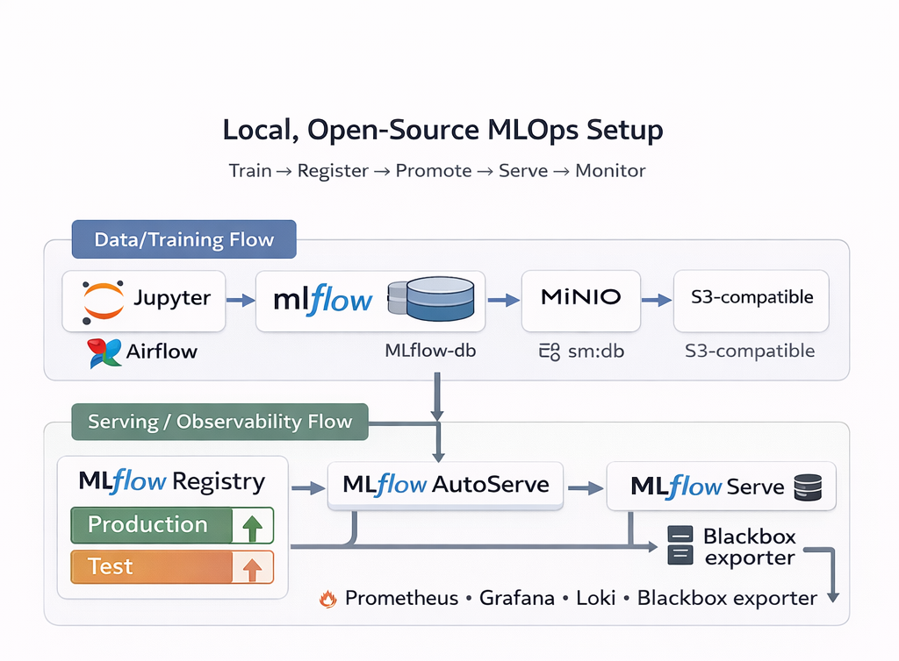
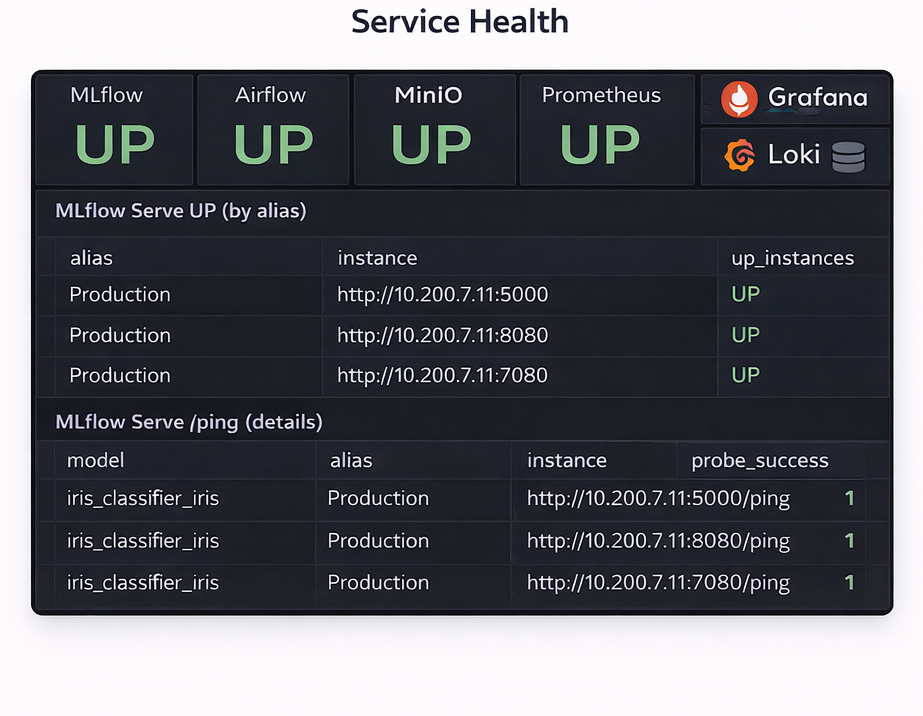

# MLOps Reference Stack (MLflow + Airflow + Prometheus + Loki)

Architecture (visual)





This repository provides a minimal, script-first MLOps stack for data scientists (Phase 1):
- you run experiments locally or in notebooks,
- every training run is logged to MLflow (params/metrics/artifacts),
- artifacts are stored in MinIO,
- MLflow models are served via standard `mlflow models serve` containers (auto-managed),
- Prometheus/Grafana monitor all services.

Key components
- MLflow + PostgreSQL for tracking and model registry
- MinIO for artifact storage (S3-compatible)
- Airflow for batch and scheduled tasks only
- MLflow autoserve watcher (spawns `mlflow models serve` per alias)
- Prometheus + Grafana (metrics dashboards)
- Loki + Promtail (log aggregation)

Docs
- Demo guide (EN): [docs/DEMO.md](docs/DEMO.md)
- Architecture and end-to-end flow (EN): [docs/ARCHITECTURE.md](docs/ARCHITECTURE.md)
- Architecture (RU): [docs/ARCHITECTURE_RU.md](docs/ARCHITECTURE_RU.md)
- Scripts & DAGs (EN): [docs/SCRIPTS.md](docs/SCRIPTS.md)

Local Python environment (optional)
```bash
python -m venv .venv
source .venv/bin/activate
pip install -r requirements.txt
```

Quick start
```bash
cp env.dev.example .env
docker compose --env-file .env up -d --build
```

Auto-demo runs via the `demo-bootstrap` container and does:
- health checks for core services,
- unpause/trigger DAGs `dag_data_predictions` and `dag_training`.

If you need to reset MLflow experiments on start, add to .env:
```
BOOTSTRAP_RESET_MLFLOW=true
```

Demo flow (auto on first start)
1) `demo-bootstrap` triggers `dag_data_predictions` (loads dataset into app-db).
2) `demo-bootstrap` triggers `dag_training` (trains models, logs metrics in MLflow).
3) Training automatically assigns alias `Production` to the best version.
4) `mlflow-autoserve` starts `mlflow models serve` for all aliases.
5) Prometheus/Grafana start collecting health signals immediately.

Main endpoints (ports are defined in .env)
- MLflow UI: http://localhost:${MLFLOW_PORT}
- Airflow UI: http://localhost:${AIRFLOW_WEB_PORT}
- MinIO Console: http://localhost:${MINIO_CONSOLE_PORT}
- Grafana: http://localhost:${GRAFANA_PORT}
- Prometheus: http://localhost:${PROMETHEUS_PORT}
- Loki: http://localhost:${LOKI_PORT}

Dashboards
- Grafana dashboards are provisioned from [monitoring/grafana/dashboards-min](monitoring/grafana/dashboards-min)
- Use dashboard "Service Health Detailed" to verify each service is alive.
- Use dashboard "MLflow Serving" to inspect model serving status and /ping health.

Workflow (data scientist view)
1) Build features in notebooks, Airflow, or service.
2) Train locally and log to MLflow (params/metrics/artifacts).
3) Assign alias (for example, `Production`) to the candidate model.
4) `mlflow-autoserve` auto-starts `mlflow models serve` for each alias.
5) When ready, promote by switching MLflow alias to a new version.

Why MLflow here?
MLflow provides model registry, run metadata, metrics comparison, and artifact storage. Even if you upload datasets directly, MLflow gives reproducibility, auditability, and easy promotion/rollback via aliases.

Python toolkit
Install and use the CLI from [README_library.md](README_library.md) to automate MLflow aliases (Phase 1).

How to call MLflow served models (inside Docker network):
```bash
docker ps --format '{{.Names}}' | grep mlflow-serve-
docker run --rm --network mlops_default curlimages/curl:8.5.0 -sS http://<mlflow-serve-container>:8080/ping
```
Inference example:
```bash
docker run --rm --network mlops_default curlimages/curl:8.5.0 -sS \
	-H 'Content-Type: application/json' \
	-d '{"dataframe_records":[{"feature_a":1,"feature_b":2}]}' \
	http://<mlflow-serve-container>:8080/invocations
```
Get the expected feature order from MLflow artifacts: `data_contract/input_schema.json`.

Notes
- Airflow is kept for scheduled/batch workflows only (daily/weekly retraining or batch predictions).
- Online inference is performed via MLflow serving containers.
- Legacy model server is still available via Compose profile: `--profile legacy`.

