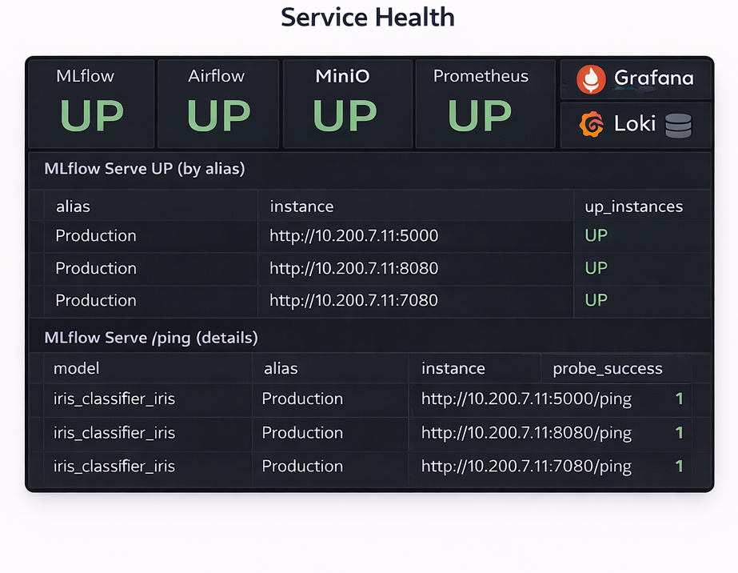

# MLOps Platform (MLflow + Autoserve + Monitoring)

Architecture (visual)




This repository provides a practical MLOps runtime for model registry, model serving, and observability:
- experiments and model versions are managed in MLflow,
- artifacts are stored in MinIO,
- model endpoints are auto-created from MLflow aliases,
- health and logs are visible in Grafana (Prometheus + Loki).

Current components
- MLflow + PostgreSQL (mlflow-db) for tracking and registry
- MinIO for artifacts
- External application PostgreSQL (configured from Vault) for app-side data
- MLflow autoserve for alias-driven serving containers
- Prometheus + Blackbox Exporter + Grafana for health monitoring
- Loki + Promtail for centralized logs

Docs
- Architecture and flow (EN): [docs/ARCHITECTURE.md](docs/ARCHITECTURE.md)
- Architecture (RU): [docs/ARCHITECTURE_RU.md](docs/ARCHITECTURE_RU.md)

Local Python environment (optional)
```bash
python -m venv .venv
source .venv/bin/activate
pip install -r requirements.txt
```

Quick start
```bash
set -a
source /data/aturov/vault/scripts/export-env.sh kv/data/dev/mlops
source /data/aturov/vault/scripts/export-env.sh kv/data/dev/grafana
source /data/aturov/vault/scripts/export-env.sh kv/data/dev/minio
source /data/aturov/vault/scripts/export-env.sh kv/data/dev/mlflow
source /data/aturov/vault/scripts/export-env.sh kv/data/dev/airflow
set +a
docker compose up -d --build
```

Development deploy via CI
- Branch: dev
- Jobs: build_dev -> deploy_dev
- Secrets source: Vault paths kv/data/dev/mlops, kv/data/dev/grafana, kv/data/dev/minio, kv/data/dev/mlflow
- Compose project name: mlops

Main endpoints (ports are defined via Vault environment variables)
- MLflow UI: http://localhost:${MLFLOW_PORT}
- MinIO Console: http://localhost:${MINIO_CONSOLE_PORT}
- Grafana: http://localhost:${GRAFANA_PORT}
- Prometheus: http://localhost:${PROMETHEUS_PORT}
- Loki: http://localhost:${LOKI_PORT}

Dashboards
- Grafana dashboards are provisioned from [monitoring/grafana/dashboards-min](monitoring/grafana/dashboards-min)
- Use dashboard "Service Health Detailed" to verify each service is alive.
- Use dashboard "MLflow Serving" to inspect model serving status and /ping health.

Platform workflow
1) Register or update model versions in MLflow.
2) Assign aliases in registry (champion, challenger).
3) Autoserve detects aliases and runs/updates serving containers.
4) Blackbox probes /ping, dashboards show model@alias health.
5) Promote or rollback by moving aliases only (no manual container management).

Serving project mapping
- By default autoserve marks serving containers as separate projects:
	- `champion -> models_champion`
	- `challenger -> models_challenger`
- Configure with `MLFLOW_SERVE_ALIAS_PROJECTS` or per-alias overrides `MLFLOW_SERVE_PROJECT_CHAMPION` / `MLFLOW_SERVE_PROJECT_CHALLENGER`.

MLflow experiment for tag/alias testing
- Existing experiment: scoring_eldik
- Recommended model registry flow:
	1. Pick target registered model version from MLflow UI.
	2. Assign alias challenger for validation traffic.
	3. Validate endpoint and metrics.
	4. Move alias champion when ready.
	5. Rollback by switching champion to previous version.

CLI examples (mlops-toolkit)
```bash
mlops-toolkit alias status --model-name scoring_eldik --aliases champion,challenger
mlops-toolkit alias set --model-name scoring_eldik --version <VERSION> --alias challenger
mlops-toolkit alias set --model-name scoring_eldik --version <VERSION> --alias champion
```

Why this setup
- minimal operational overhead for a small team,
- alias-driven champion/challenger releases and rollback,
- clear observability for service and model endpoint health,
- reusable local and CI deployment path.

Python toolkit
Install and use the CLI from [README_library.md](README_library.md) to automate MLflow aliases (Phase 1).

How to call served models (inside Docker network):
```bash
docker ps --format '{{.Names}}' | grep mlflow-serve-
docker run --rm --network mlops_default curlimages/curl:8.5.0 -sS http://<mlflow-serve-container>:8080/ping
```
Inference example:
```bash
docker run --rm --network mlops_default curlimages/curl:8.5.0 -sS \
	-H 'Content-Type: application/json' \
	-d '{"dataframe_records":[{"feature_a":1,"feature_b":2}]}' \
	http://<mlflow-serve-container>:8080/invocations
```
The helper script `scripts/predict_request.py` can be used for the same `/invocations` smoke test.
To inspect what the model accepts on input, use `scripts/print_model_input_schema.py` or open the model artifacts in MLflow UI.
The primary sources are `model/MLmodel` for signature and `model/serving_input_example.json` for a ready `/invocations` payload; `data_contract/input_schema.json` is optional and model-dependent.

How to inspect model input in MLflow
1) Open MLflow UI and find the registered model version behind alias `champion` or `challenger`.
2) Open its artifacts and inspect `model/MLmodel`.
3) Read the `signature` section in `MLmodel` to see input names, dtypes, and shapes.
4) Open `model/serving_input_example.json` to get a ready payload for `POST /invocations`.
5) Optionally open `model/input_example.json` for the raw input example and `data_contract/input_schema.json` if the training pipeline logged it.

How to validate scoring
1) Ensure the serving container exists: `docker ps --format '{{.Names}}' | grep mlflow-serve-`.
2) Check health with `GET /ping`.
3) Send the payload from `model/serving_input_example.json` to `POST /invocations`.
4) For a quick CLI check, use `scripts/predict_request.py --url http://<mlflow-serve-container>:8080 --payload <payload.json>`.
5) If the request succeeds and Prometheus shows `probe_success=1`, the model is both serving and reachable.

If the model is a multi-input PyTorch network, see the checklist in `docs/ARCHITECTURE.md` before registering it in MLflow. The important rule is that `/invocations` should be designed first, and the MLflow pyfunc wrapper, signature, and examples should be logged to match that contract exactly.

Notes
- Online inference is performed by alias-driven MLflow serving containers.
- The runtime is centered on MLflow registry, autoserve, and monitoring only.

