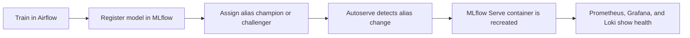

# MLOps Platform: Alias-Driven Deployment with MLflow

Deployment is not a pipeline.

Deployment is a label.

This repository is a self-contained open-source MLOps demo where model rollout happens by switching MLflow aliases such as `champion` and `challenger`. Autoserve watches the registry, recreates the right MLflow Serve containers, and the monitoring stack shows the result immediately.


```mermaid
flowchart LR
    A[Train in Airflow] --> B[Register in MLflow]
    B --> C[Assign alias]
    C --> D[Autoserve reconcile]
    D --> E[MLflow Serve]
    E --> F[Monitor in Grafana]
```

For the first-screen version of this diagram, see [docs/SIMPLE_DIAGRAM.md](docs/SIMPLE_DIAGRAM.md).

## Why This Project Exists

Most ML stacks still treat deployment as external CI/CD choreography.

This project keeps the serving decision inside the model registry:
- train in Airflow
- register in MLflow
- switch alias
- autoserve redeploys the target model
- Prometheus, Grafana, and Loki show health and runtime evidence

The result is a local, reproducible stack for teams that want to demonstrate or validate alias-driven deployment without buying into a proprietary platform.

## Core Idea

By switching MLflow aliases, this stack can:
- deploy a new model instantly
- avoid downtime during rollout
- roll back in seconds
- keep deployment semantics inside the registry instead of a separate release workflow

## Simple Flow


```mermaid
flowchart LR
    A[Train in Airflow] --> B[Register model in MLflow]
    B --> C[Assign alias champion or challenger]
    C --> D[Autoserve detects alias change]
    D --> E[MLflow Serve container is recreated]
    E --> F[Prometheus, Grafana, and Loki show health]
```

## Visuals


## 2-Minute Demo

Start the full stack:

```bash
make demo
```

Verify the demo runtime:

```bash
make verify
```

Then open:
- MLflow UI: `http://localhost:15000`
- Airflow UI: `http://localhost:18885`
- Grafana: `http://localhost:13000`
- Prometheus: `http://localhost:19090`
- MinIO Console: `http://localhost:19023`
- Autoserve health: `http://localhost:15010/health`

What you should see within a couple of minutes:
- demo data loaded by `dag_data_predictions`
- training runs and registered models in MLflow
- aliases `champion` and `challenger`
- autoserved model containers recreated from alias targets
- Grafana dashboards showing service and serving health

If you prefer raw Docker commands:

```bash
docker compose up -d --build
./scripts/run_demo_checks.sh
```

Optional customization:

```bash
cp .env.example .env
make demo
```

## Why Not Traditional Deployment?

| Problem | Traditional workflow | This project |
|---|---|---|
| Deployment trigger | CI/CD pipeline | MLflow alias switch |
| Rollback | Manual redeploy | Repoint alias |
| Serving control | External service layer | Registry-driven autoserve |
| Demo reproducibility | Usually fragmented | One local stack |
| Observability linkage | Added later | Built into the serving path |

## Use Cases

This architecture is designed for:
- champion/challenger rollouts with MLflow Model Registry
- production-style demos for real-time model serving
- internal platform teams validating registry-driven deployment patterns
- scoring systems where rollback speed matters more than release ceremony

## What Starts Automatically

After `make demo`, the stack bootstraps:
- MinIO bucket creation for MLflow artifacts
- Airflow metadata initialization and demo admin user
- `dag_data_predictions` and `dag_training`
- alias-driven autoserve for `champion` and `challenger`
- a prediction integration path that writes explicit MLflow traces
- Grafana, Prometheus, Loki, Promtail, and Blackbox monitoring

The public repo does not use Vault and runs under the isolated Compose project `mlops-demo` with network `mlops-demo_default`.

## API Entry Point

Each deployed alias is exposed by an MLflow Serve container with:
- health endpoint: `GET /ping`
- inference endpoint: `POST /invocations`

In this demo, autoserved containers stay inside the Docker network. The repo already includes the request path used in integration checks:

```bash
docker ps --format '{{.Names}}' | grep mlflow-serve-
python scripts/predict_request.py --url http://<serve-container-ip>:8080 --payload /path/to/payload.json
```

To inspect the expected input format for a promoted alias:

```bash
python scripts/print_model_input_schema.py --model-name iris_classifier_iris --alias champion --tracking-uri http://localhost:15000
```

The current demo payload source is `data_contract/sample_input.csv`, logged during training and reused by the integration test.

## Default Credentials

- Airflow UI: `admin` / `admin`
- Grafana: `admin` / `admin`
- MinIO: `minioadmin` / `minioadmin123`

## What To Open After Startup

- MLflow experiment `iris-classification_iris` for runs, models, and traces
- Grafana dashboards `MLOps Overview`, `Service Health Detailed`, and `MLflow Serving`
- Airflow DAGs `dag_data_predictions` and `dag_training`

## Stack Components

- MLflow + PostgreSQL for tracking and model registry
- MinIO for artifacts
- Airflow + PostgreSQL for orchestration and bootstrap
- App PostgreSQL for demo data and predictions
- MLflow autoserve for alias-driven online serving
- Prometheus + Grafana + Loki + Promtail for observability

## Docs

- Documentation hub: [docs/README.md](docs/README.md)
- Simple first-screen diagram: [docs/SIMPLE_DIAGRAM.md](docs/SIMPLE_DIAGRAM.md)
- Conference demo script: [docs/CONFERENCE_SCRIPT.md](docs/CONFERENCE_SCRIPT.md)
- Demo runbook (EN): [docs/DEMO.md](docs/DEMO.md)
- Architecture and system flow (EN): [docs/ARCHITECTURE.md](docs/ARCHITECTURE.md)
- Architecture and selling points (RU): [docs/ARCHITECTURE_RU.md](docs/ARCHITECTURE_RU.md)
- Python toolkit docs: [README_library.md](README_library.md)

## Notes

- Online inference is handled by alias-driven MLflow Serve containers.
- `GET /metrics` returning `404` on serve containers is expected; health is tracked through `/ping` via Blackbox.

