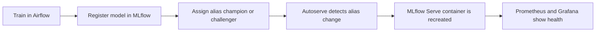

# MLOps Platform: Alias-Driven Deployment with MLflow


This repository is a self-contained public demo of local MLOps on a budget.

It starts a full stack with one command:

```bash
docker compose up -d --build
```

The stack includes:
- MLflow + PostgreSQL for tracking and model registry
- MinIO for artifacts
- Airflow + PostgreSQL for orchestration and demo bootstrap
- App PostgreSQL for demo data and predictions
- MLflow autoserve for alias-driven online serving
- Prometheus + Grafana + Loki + Promtail for observability

## Core Idea

Deployment is not a pipeline.

Deployment is a label.

By switching MLflow aliases, this stack can:
- deploy a new model instantly
- avoid downtime during rollout
- roll back in seconds

## Simple Flow


```mermaid
flowchart LR
    A[Train in Airflow] --> B[Register model in MLflow]
    B --> C[Assign alias champion or challenger]
    C --> D[Autoserve detects alias change]
    D --> E[MLflow Serve container is recreated]
    E --> F[Prometheus and Grafana show health]
```

## Quick Start

```bash
docker compose up -d --build
```

Optional customization:

```bash
cp .env.example .env
docker compose up -d --build
```

Default demo credentials:
- Airflow UI: `admin` / `admin`
- Grafana: `admin` / `admin`
- MinIO: `minioadmin` / `minioadmin123`

Default demo ports:
- MLflow UI: `http://localhost:15000`
- Airflow UI: `http://localhost:18885`
- MinIO API: `http://localhost:19000`
- MinIO Console: `http://localhost:19023`
- Grafana: `http://localhost:13000`
- Prometheus: `http://localhost:19090`
- Loki: `http://localhost:13100`
- Autoserve health: `http://localhost:15010/health`

The public repo does not use Vault and runs under the isolated Compose project `mlops-demo` with network `mlops-demo_default`.

## What Starts Automatically

- MinIO bucket bootstrap
- Airflow metadata initialization
- Demo admin user creation in Airflow
- `dag_data_predictions` and `dag_training`
- alias-driven autoserve for `champion` and `challenger`
- prediction integration test from bootstrap
- explicit MLflow traces for the demo experiment

## Demo Scenario

This is the stage-friendly flow:

1. Train model.
2. Assign alias.
3. Watch auto-deploy.

In this repository the first two steps already happen during bootstrap, so the live part of the demo is the alias switch and the instant serving update.

## Traditional vs This Approach

| Step | Traditional | This project |
|---|---|---|
| Deployment | CI/CD pipeline | Alias switch |
| Rollback | Manual redeploy | Instant alias move |
| Serving | Custom API service | MLflow serve |
| Release target | Environment-specific | Registry alias |
| Validation | Separate release stage | `challenger` side-by-side |

## How To See Demo Traces

1. Open MLflow at `http://localhost:15000`.
2. Open experiment `iris-classification_iris`.
3. Open the `Traces` tab.
4. You should see traces created by the bootstrap prediction test.
5. If you want to replay them manually, run:

```bash
RUN_INTEGRATION_TESTS=1 pytest -q test/test_integration_predictions.py
```

That test:
- resolves model versions by experiment name and alias
- sends real `/invocations` requests to `champion` and `challenger`
- writes explicit MLflow traces into the demo experiment

## Why This Architecture Works

- It keeps deployment semantics inside the model registry.
- It avoids a custom serving control plane.
- It makes rollback a metadata operation instead of an infrastructure operation.
- It gives one reproducible local stack for demos, development, and debugging.
- It keeps observability close to the serving path.

## Docs

- Demo guide (EN): [docs/DEMO.md](docs/DEMO.md)
- Architecture and flow (EN): [docs/ARCHITECTURE.md](docs/ARCHITECTURE.md)
- Architecture and selling points (RU): [docs/ARCHITECTURE_RU.md](docs/ARCHITECTURE_RU.md)
- Python toolkit docs: [README_library.md](README_library.md)

## Notes

- Online inference is handled by alias-driven MLflow Serve containers.
- `GET /metrics` returning `404` on serve containers is expected; health is tracked through `/ping` via Blackbox.
- The current demo payload source is `data_contract/sample_input.csv`, which is logged during training and reused by the integration test.

