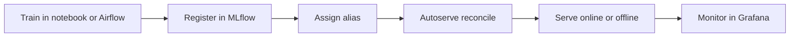
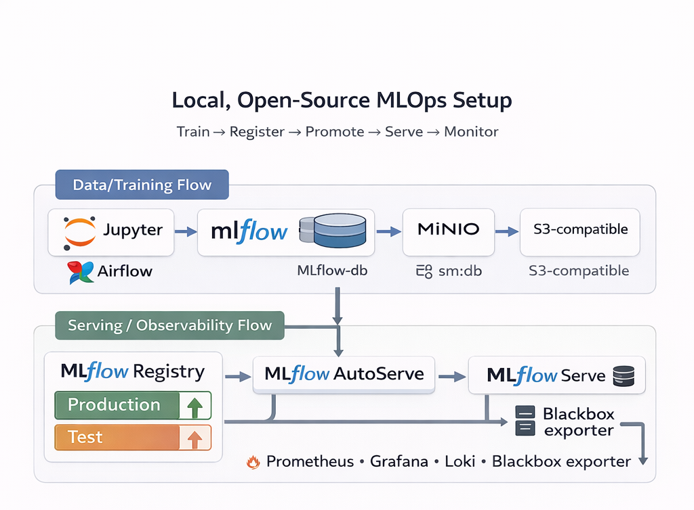
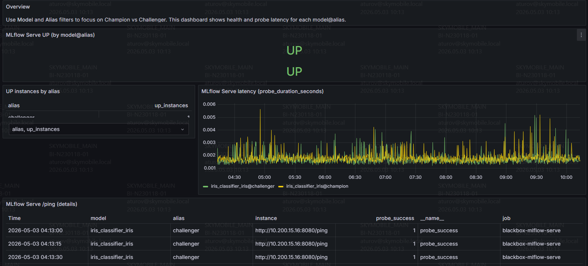
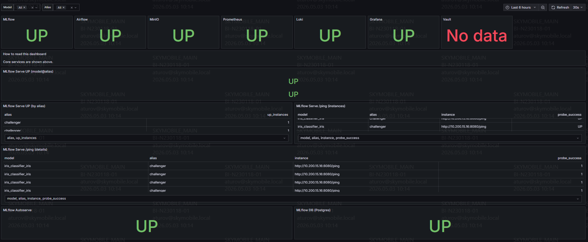

# Production ML without CI/CD: Deploy Models by Switching Aliases

Deployment is not a pipeline.

Deployment is a label.

This repository is a self-contained open-source MLOps demo where model rollout happens by switching MLflow aliases such as `champion` and `challenger`. Autoserve watches the registry, recreates the right MLflow Serve containers, and Grafana shows the result using Prometheus metrics and Loki logs.


```mermaid
flowchart LR
    A[Train in notebook or Airflow] --> B[Register in MLflow]
    B --> C[Assign alias]
    C --> D[Autoserve reconcile]
    D --> E[Serve online or offline]
    E --> F[Monitor in Grafana]
```

For the first-screen version of this diagram, see [docs/SIMPLE_DIAGRAM.md](docs/SIMPLE_DIAGRAM.md).

## Quick Start

Clone the repo and run the demo:

```bash
git clone https://github.com/AleksTurov/mlops.git
cd mlops-github-work
cp .env.example .env
make demo
```

Verify the runtime:

```bash
make verify
```

If you prefer raw Docker commands:

```bash
git clone https://github.com/AleksTurov/mlops.git
cd mlops-github-work
cp .env.example .env
docker compose up -d --build
./scripts/run_demo_checks.sh
```

## What You Get In 2 Minutes

- trained model in MLflow
- `champion` and `challenger` aliases
- auto-deployed serving containers
- Grafana dashboards with live health
- end-to-end demo traces written to MLflow

## Where To Look

- MLflow UI: `http://localhost:15000`
- Airflow UI: `http://localhost:18885`
- Grafana: `http://localhost:13000`
- Prometheus: `http://localhost:19090`
- MinIO Console: `http://localhost:19023`
- Autoserve health: `http://localhost:15010/health`

## Why This Project Exists

Most ML stacks still treat deployment as external CI/CD choreography.

This project keeps the serving decision inside the model registry:
- train in Airflow or notebooks
- load data from batch pipelines, databases, or feature stores
- register in MLflow
- switch alias
- let autoserve redeploy the target model
- observe health and runtime evidence in Grafana

The result is a local, reproducible stack for teams that want to demonstrate or validate alias-driven deployment without buying into a proprietary platform.

## Why Not Traditional Deployment?

| Problem | Traditional workflow | This project |
|---|---|---|
| Deployment trigger | CI/CD pipeline | MLflow alias switch |
| Rollback | Manual redeploy | Repoint alias |
| Serving control | External service layer | Registry-driven autoserve |
| Demo reproducibility | Usually fragmented | One local stack |
| Observability linkage | Added later | Built into the serving path |

## Why This Instead Of Full MLOps Platforms?

This project is intentionally narrower than Kubeflow, SageMaker, or other full-stack MLOps platforms.

It is useful when you want:
- no cloud dependency for the core demo path
- no vendor lock-in around deployment semantics
- a stack you can reproduce locally
- minimal setup focused on model registry workflows
- a clear alias-driven rollout story instead of a broad platform installation

It is not trying to replace every feature of a full MLOps platform. It is a smaller system for teams validating registry-driven deployment and rollback.

## Who Is This For?

- ML engineers building internal platforms
- data scientists moving models closer to production
- teams experimenting with model registry workflows
- engineering teams that need a reproducible local demo for model rollout patterns

## Use Cases

- champion/challenger rollouts with MLflow Model Registry
- production-style demos for online and offline inference flows
- internal platform validation for registry-driven deployment patterns
- scoring systems where rollback speed matters more than release ceremony

## What Starts Automatically

After `make demo`, the stack bootstraps:
- MinIO bucket creation for MLflow artifacts
- Airflow metadata initialization and demo admin user
- `dag_data_predictions` and `dag_training`
- alias-driven autoserve for `champion` and `challenger`
- a prediction integration path that writes explicit MLflow traces
- Grafana, Prometheus, Loki, Promtail, and Blackbox monitoring

Airflow is the default orchestration path in this demo, but the alias-driven deployment model does not depend on Airflow specifically. The same registry and autoserve flow can be fed from notebook-driven experiments or other training pipelines.

The public repo does not use Vault and runs under the isolated Compose project `mlops-demo` with network `mlops-demo_default`.

## API Entry Point

Each deployed alias is exposed by an MLflow Serve container with:
- health endpoint: `GET /ping`
- inference endpoint: `POST /invocations`

In this demo, autoserved containers stay inside the Docker network, so the canonical request path is the one already covered by the repo tests and helper scripts.

Use these entry points:
- exact end-to-end request path: [test/test_integration_predictions.py](test/test_integration_predictions.py)
- manual request helper: [scripts/predict_request.py](scripts/predict_request.py)
- input schema inspection: [scripts/print_model_input_schema.py](scripts/print_model_input_schema.py)

To replay the tested champion request path directly:

```bash
RUN_INTEGRATION_TESTS=1 .venv/bin/python -m pytest -q test/test_integration_predictions.py -k champion
```

The current demo payload source is `data_contract/sample_input.csv`, logged during training and reused by the integration test.

## Visuals







## Docs

- Documentation hub: [docs/README.md](docs/README.md)
- Simple first-screen diagram: [docs/SIMPLE_DIAGRAM.md](docs/SIMPLE_DIAGRAM.md)
- Conference demo script: [docs/CONFERENCE_SCRIPT.md](docs/CONFERENCE_SCRIPT.md)
- Demo runbook (EN): [docs/DEMO.md](docs/DEMO.md)
- Architecture and system flow (EN): [docs/ARCHITECTURE.md](docs/ARCHITECTURE.md)
- Architecture and selling points (RU): [docs/ARCHITECTURE_RU.md](docs/ARCHITECTURE_RU.md)
- Python toolkit docs: [README_library.md](README_library.md)

## Notes

- Online inference is handled by alias-driven MLflow Serve containers.
- `GET /metrics` returning `404` on serve containers is expected; health is tracked through `/ping` via Blackbox.

