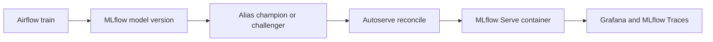

# Архитектура и операционная модель (RU)

Этот документ объясняет, как устроен стек, почему alias-driven deployment меняет модель эксплуатации, и за счет чего demo выглядит убедительно как для инженерной аудитории, так и для стейкхолдеров.

Связанные документы:
- [README.md](../README.md)
- [SIMPLE_DIAGRAM.md](SIMPLE_DIAGRAM.md)
- [DEMO.md](DEMO.md)
- [CONFERENCE_SCRIPT.md](CONFERENCE_SCRIPT.md)

## 1) Главная идея

**Deployment is not a pipeline. Deployment is a label.**

В этой архитектуре выкладка модели не равна отдельному CI/CD-процессу.

Выкладка модели равна переключению alias в MLflow Registry.

Это значит, что мы можем:
- мгновенно выкладывать новую модель,
- делать rollback за секунды,
- не держать отдельный кастомный deployment orchestrator,
- использовать MLflow Registry как источник истины для serving.

Именно в этом и состоит core innovation проекта: promotion и rollback становятся операциями над metadata, а не отдельным инфраструктурным сценарием.

## 2) Что здесь происходит

Стек поднимает полноценный локальный MLOps-контур:
- **MLflow** хранит experiments, registry моделей, alias и traces.
- **MinIO** хранит артефакты моделей.
- **Airflow** готовит данные, запускает обучение и bootstrap demo-сценария.
- **MLflow Autoserve** следит за alias и поднимает serving-контейнеры автоматически.
- **Prometheus + Grafana + Loki** дают health, логи и наблюдаемость.

Итоговый поток очень простой:



## 3) Почему эта модель работает

Главная сильная сторона не в количестве сервисов, а в том, что deployment становится дешевой, быстрой и обратимой операцией.

### Практические преимущества
- **Быстрый rollout**: новая версия появляется через alias, а не через отдельный deployment pipeline.
- **Мгновенный rollback**: достаточно вернуть alias на предыдущую версию.
- **Прозрачность**: registry, serving, health и traces видны в одном контуре.
- **Минимум кастомного кода**: serving построен на стандартном MLflow Serve.
- **Один воспроизводимый контур**: тот же стек подходит для demo, разработки и диагностики.
- **Понятная демонстрация на сцене**: train → alias → auto-deploy видно сразу и без дополнительных пояснений.

## 4) Traditional vs This Approach

| Шаг | Традиционный подход | Этот проект |
|---|---|---|
| Deployment | CI/CD pipeline | Переключение alias |
| Rollback | Ручной redeploy | Мгновенный alias move |
| Serving | Кастомный API сервис | MLflow serve |
| Release target | Среда / environment | Alias в registry |
| Validation | Отдельный релизный процесс | `challenger` рядом с `champion` |

## 5) Компоненты

### MLflow
- хранит experiments,
- хранит registered models и versions,
- держит alias `champion` и `challenger`,
- отображает traces demo-запросов.

### MinIO
- хранит MLflow artifacts,
- содержит модель, зависимости и data contract.

### Airflow
- запускает `dag_data_predictions`,
- запускает `dag_training`,
- через `demo-bootstrap` поднимает demo в рабочее состояние.

### MLflow Autoserve
- читает registry,
- находит версии за alias,
- пересоздает `mlflow-serve-*` контейнеры,
- тем самым превращает alias в реальный deployment mechanism.

### Observability stack
- Prometheus и Blackbox проверяют доступность,
- Grafana показывает состояние сервисов и alias,
- Loki хранит логи,
- MLflow показывает traces demo-запросов.

Наблюдаемость здесь намеренно расположена рядом с механизмом выкладки: после изменения alias тот же контур сразу показывает health, логи и trace evidence.

## 6) Сценарий для live demo

Сценарий предельно простой:

1. **Step 1: train model**
2. **Step 2: assign alias**
3. **Step 3: watch auto-deploy**

Практически это выглядит так:
- в Airflow появляется успешный training run,
- в MLflow появляется новая model version,
- alias `champion` или `challenger` указывает на нужную версию,
- autoserve автоматически пересоздает serving-контейнер,
- Grafana показывает, что endpoint жив,
- MLflow показывает traces demo-запросов.

Этот сценарий работает убедительно, потому что deployment виден как операция над metadata, а не как отдельный инфраструктурный ceremony.

## 7) Как работает demo bootstrap

После `docker compose up -d --build` автоматически происходит:
- инициализация MinIO bucket,
- инициализация Airflow metadata,
- запуск `dag_data_predictions`,
- запуск `dag_training`,
- запуск integration test на prediction path,
- запись MLflow traces в experiment `iris-classification_iris`.

То есть demo после старта уже не пустая: в ней есть модель, alias, serving-контейнеры, health и traces.

## 8) Где смотреть результат

### MLflow
- UI: `http://localhost:15000`
- experiment: `iris-classification_iris`
- вкладка `Models`: версии и alias
- вкладка `Traces`: demo-traces после bootstrap/test run

### Airflow
- UI: `http://localhost:18885`
- проверить `dag_data_predictions` и `dag_training`

### Grafana
- UI: `http://localhost:13000`
- открыть `MLOps Overview`
- открыть `Service Health Detailed`
- открыть `MLflow Serving`

### Serve контейнеры
- `mlflow-serve-iris_classifier_iris-champion`
- `mlflow-serve-iris_classifier_iris-challenger`

## 9) Что важно понимать про traces

Обычные `POST /invocations` в MLflow Serve не дали traces автоматически в этом стенде.

Поэтому demo path делает это явно:
- integration test отправляет реальный prediction request,
- после успешного ответа записывает trace через MLflow trace API,
- trace попадает в experiment `iris-classification_iris`.

Это делает demo предсказуемой: traces появляются всегда, без зависимости от скрытого поведения serve runtime.

## 10) Как быстро перепроверить demo

После `docker compose up -d --build` используйте:

```bash
./scripts/run_demo_checks.sh
```

Если нужен только повтор prediction/traces path:

```bash
RUN_INTEGRATION_TESTS=1 .venv/bin/python -m pytest -q test/test_integration_predictions.py
```

## 11) Почему это сильный public demo

- Не нужен Vault.
- Не нужен внешний deployment pipeline.
- Не нужен отдельный custom serving layer.
- Все поднимается локально одной командой.
- Архитектура понятна и для инженеров, и для менеджмента.

Если формулировать коротко:

**Мы превращаем deployment модели из тяжелой DevOps-операции в дешевое переключение alias внутри MLflow Registry.**

## 12) Что читать дальше

- [DEMO.md](DEMO.md) для запуска и проверки стенда.
- [CONFERENCE_SCRIPT.md](CONFERENCE_SCRIPT.md) для короткого выступления или live demo.
- [SCRIPTS.md](SCRIPTS.md) для справки по утилитам и DAG.

