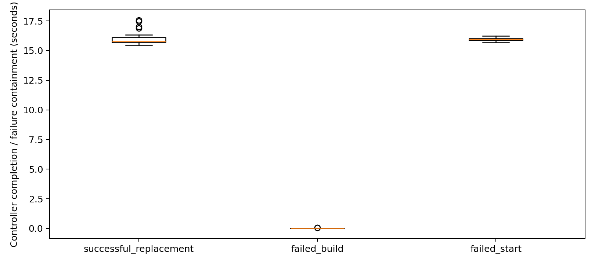

# Autoserve behavior and measured validation

The project uses MLflow aliases to request serving deployments. This document records the current replacement behavior and isolated measurements from 2026-10-05. These results do not establish a performance advantage over other platforms.

## Replacement and failure handling

The [controller](../src/app/mlflow_autoserve.py) polls aliases sequentially. For a changed version it prepares an image for that exact version while the previous container keeps running, starts a candidate and waits for HTTP `/ping`. It rechecks the alias before activation, renames the previous container to a rollback name, assigns the candidate the canonical name, and checks readiness again. Only then is the previous container removed.

On a handled preparation or startup failure, the candidate is removed and the previous container retained; its canonical name is restored if needed. The previous alias is restored only when the alias still points to the failed requested version. Registry unavailability can prevent restoration and is logged. Failed registry scans are logged and retried on subsequent polls; incomplete scans do not trigger reconciliation.

`/ping` checks serving readiness rather than prediction quality. Existing Blackbox/Prometheus probes and Loki logs remain the monitoring path. No deployment event store or new Grafana dashboard is introduced.

Container renaming is not an atomic traffic switch: cached DNS and requests in flight can fail. There is no request draining, proxy routing or distributed coordination between controllers. Alias read/check/write is not atomic compare-and-set. Process crashes during handover and simultaneous promotions were not evaluated.

Assigning an earlier version to an alias requests another deployment through polling and readiness checks. Registry history alone does not record when a version actually served traffic. Historical prediction replay also requires original inputs, preprocessing, artifacts and compatible runtime dependencies.

## Measurements

Twenty sequential repetitions of each scenario used real Docker containers, a private SQLite MLflow registry and two scikit-learn LogisticRegression versions trained on public Iris data. The host called the controller directly, excluding polling and queueing delays. PostgreSQL, MinIO and monitoring services were not used by the experiment.

| Scenario | N | Mean (s) | Median (s) | P95 (s) | Expected behavior |
|---|---:|---:|---:|---:|---|
| Successful replacement | 20 | 16.103 | 15.816 | 17.465 | 20/20 replacements passed |
| Missing artifact (`failed_build`) | 20 | 0.040 | 0.039 | 0.045 | 20/20 retained old container and restored alias |
| Startup failure (`failed_start`) | 20 | 15.944 | 15.964 | 16.153 | 20/20 retained old container and restored alias |

P95 uses nearest rank. Injected failures have 0% deployment success and 100% expected-behavior pass rate: successful containment is distinct from successful deployment.

`deployment_seconds` starts before availability-monitor startup and alias assignment and ends at controller return or error after alias restoration. `scenario_check_seconds` additionally includes validation and the sampling tail. Initial deployment is excluded. Successful replacements use an absent model image, prepared base image and retained Docker build cache. Missing artifacts fail before Docker build execution; dependency build failures were not tested. Startup failures use an actual image without a model and a 15-second readiness timeout, versus the controller default of 120 seconds.

No failures occurred among 5,616 `/ping` samples at nominal 0.1-second intervals. The monitor resolves the canonical name through the Docker API to its current IP; Docker DNS and predictions are checked from a separate client container after successful replacement. This does not prove uninterrupted availability for DNS-caching clients or sustained inference traffic.



Environment: shared Intel Xeon Gold 6430 host, 64 logical CPUs, approximately 504 GiB RAM, no test CPU/memory limits, GPU disabled. Docker Engine 29.2.1; Compose 5.0.2; host Python 3.10.12; serving Python 3.10.22; MLflow 3.5.0; scikit-learn 1.5.2; NumPy 1.26.4. These results cover one host, one framework and two versions, not production release counts or comparative benchmarks.

Evaluated commit: `996d0f98b92dcb7d1c4e950f77191cebce1584d6`. Controller SHA256: `e70281753dae24ba93a7e4a1715940d298a73793d48104b3c6e114af5550c777`.

Evidence:

- [Raw measurements: 60 scenario rows](measurements/2026-10-05/benchmark_results.csv)
- [Summary statistics](measurements/2026-10-05/benchmark_summary.json)
- [Measurement configuration](measurements/2026-10-05/measurement_config.json)
- [Environment report and image IDs](measurements/2026-10-05/environment.txt)

Review correspondence, manuscript PDFs, registry databases and model artifacts are excluded from this public documentation bundle.

## Reproduction

With Docker and project Python dependencies available, run from the repository root:

```bash
docker compose build mlflow-autoserve
make check-deployment
make measure-deployments MEASUREMENT_ARGS='--repetitions 20 --output /tmp/mlops-measurements'
make environment-report
```

See [check_deployment.py](../scripts/check_deployment.py), [measure_deployments.py](../scripts/measure_deployments.py) and [environment_report.py](../scripts/environment_report.py) for options and assertions. Checks create unique networks, model names and ownership labels, and clean up only their own Docker resources. Their serving label differs from normal Autoserve ownership so existing controllers do not adopt them. Rebuilding the base image can change dependencies; record image identities when comparing runs.
