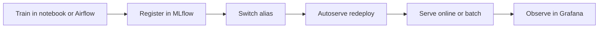

# Simple Diagram

Use this diagram on the first screen of the README, in slide decks, or as the opening visual in a live demo.

## First-Screen Flow

## Message To Say Next To It

Deployment is not a pipeline.

Deployment is a label.

The model rollout decision lives in MLflow Registry. Changing the alias changes the deployed model, and the monitoring stack confirms the result.

Grafana is the UI layer here, with Prometheus providing metrics and Loki providing logs.

## When To Use The Full Diagram Instead

Use [Mlops_01.png](Mlops_01.png) when the audience needs to understand the complete platform layout: MLflow, notebook or Airflow-based training, artifact storage, autoserve, and observability.